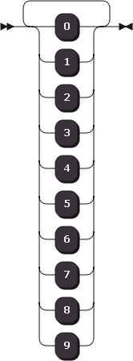
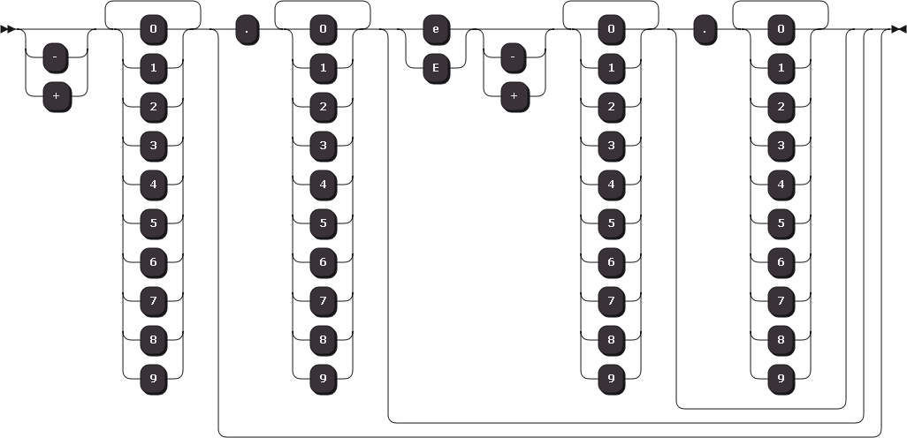
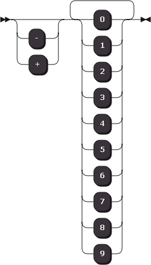
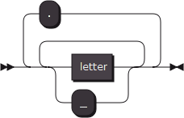
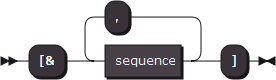
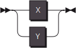
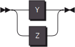
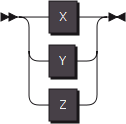
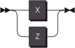

# IGP

> Imperfect grammar paradigm

> Please, ask nothing about the name of this system, it is not a formal name nor it has any formal name yet.

In this page, there is a beautiful but maybe not powerful enough language is coming to the birth.

This language, i call it **"IGP"**, didn't dream to be a famous maybe popular language also, birth of it meant to solve problem by the personal style.

We have two syntax system which are very similar but take different action.

One of them, which we call **Lexical grammar**, you can checkout [lexerz](http://www.dn-ezr.cn/lexerz.xhtml) to see what it looks like in **EBNF**.

The other one, which we call **Syntax grammar**, you can go to syntz to see what it looks like in **EBNF**.

here we go.

[TOC]

## 1.numbers

Thinking you are doing lexical parsing, you need to capture a number from the text and **IGP** provides you with a method that is very similar to "regular expression",let's see it.

~~~gramz
numbers : numd
~~~

**numd** is a **built-in capture patterns** that takes numbers from 0 to 9,

you could say "<u>Are you kidding me ???</u>"

 then i'll say "<u>Oh yeah, man , I am kidding you ~</u>"

Oh come on, don't be so angry like that, let's see the formal style:

~~~gramz
numbers : +numd
~~~
Just like the regular expression, **'+'** has the special meaning, which will cause the **parser** try to <u>capture the **unit** next to the **'+'** one or more times</u>.

That is very useful, we have several symbols like that, let's delay the hand shake with them because we have to make sense what the word **'unit'** really means.

Come on, follow me "**the unit next to the '+'** ".

Right, very good, what it means ?

No doubt "**the unit next to the '+'**" refers to the **numd**,the word **'unit'** <u>here</u> stands for **one kind of built-in capture patterns**.

In fact, **'unit'** is a concept supported by **IGP**, **IGP** stipulates that a **string**, a **named capture patterns** or a **formula** will be concerned to be a **'unit'**.

In the above example, both <u>numbers</u> and <u>numd</u> are considered **named capture patterns**.

The **formulas** are those that satisfy the <u>formula syntax</u> enclosed by **square brackets**.

As for the **string**, it refers to the contents of the text enclosed in **double quotes**.

> Please note that the **distinction** between the **single** and **double** **quotation** marks in **IGP**, their meaning is different, or even **far from each other**.

By now, we can tell that this **IGP** expression matches the following strings to be number

These are positive integers, they can not represent all numbers, at least not all real numbers, could they?

No they cannot represent all numbers, nor even all real numbers.

But, if you want to express more thing, you need more skill, which will meet with you in the further content of this page.

Next section, let see how **IGP** will express a capture pattern that captures **all real numbers.**

## 2.numbers seriously

> In order to explain the other more unknown words mentioned above, we have to make our example more complicated, let's see the next example.

~~~gramz
numbers : ?'-+'+numd?["."+numd?['eE'?'-+'+numd?["."+numd]]]
~~~

In this example, the purpose is to **capture a number** from the content of text too, let's see the syntax diagram first:

As you maybe expected,**'?'** Indicates that you want to <u>capture the next **unit** once or skip it if it does not exist</u>.

Using **single quotes** to contain the <u>text content</u> is a simple expression of the **formula**.The contents of the text satisfy the <u>C language-style</u> **escape syntax**,the meaning of this type of **formula** is a **collection of possibilities**, each **character** in the **formula** is a **possibility**.

For now, we know at least, the number can <u>start with</u> character which is one of character in the string "+-0123456789".

The corresponding **IGP** expression:`numbers: ?'-+'+numd`, and the corresponding syntax diagram:

Next, what we get, is another '?' and a very big **formula**.

Of course you've already got the point, that means if possible this very big **formula** can be captured once.

The previous part of this expression as you've seen, can capture all integers, and the next part of this expression we are going to study, will change this expression to be able to capture all real numbers.

Remember the very basically function of **square brackets** is to pack a serial of units up to be **one unit**, so that we can use only one '?' to modify all them together, **to make their behaviors synchronized**.

Of course **square brackets** have another function which is similar with **single quotes**, because this is the formal style of **collection of possibilities**. Possibilities in it separate each other with **commas**, each of them can be **one or more units**.

A number of consecutive **unit**s without **special segmentation**, will be matched in accordance with **the order of writing,** once the capture of any **unit** fails, will lead to the recognition of the entire sequence was interrupted.

So far, none of the expressions we encounter have so-called **special segmentation**, we will see many expressions like that in the further pages.

In the rest of expression, the only syntax we have not met is something enclosed by **double quotes**,let's figure it out, so that you can understand this whole expression.

<u>The characters enclosed by **double quotes** is matched one by one in the order of writing</u>, yes it is very similar with the meaning of **square brackets**.Also, a pair of **double quotes** and their content will be treated as one **unit**.

Repeat reading the expression while chewing cookies, and enter the next section.

## 3.built-in capture patterns

To solve a **collection of possibilities**, parser will compare every options in this collection with text **one by one**.

In many cases, we do not need to spend so much time doing this,for example the following pattern:

~~~gramz
'abcdefghijklmnopqrstuvwxyz'
~~~

This means that if the parser reaches a 'z', it will go through 26 alignments before ending the match.

We provide you with a faster way : **built-in capture patterns**, these are a series of **named capture pattern**, which are already implemented by parser.

As for the example above, you can write down like that:

~~~gramz
lower
~~~

You have it from the beginning, and you can assume that the following code already exists, this code satisfies the grammar rules needed to define a **named capture pattern**. We will discus these grammar rules right after we finish this topic.

~~~gramz
~lower : 'abcdefghijklmnopqrstuvwxyz'
~~~

Of course, <u>it is not really been written like that, it was implemented to have the same function but faster .</u>

We have a series of **built-in capture patterns** like this, which have different functions that you will need.

Next, we will enumerate the "<u>definition</u>" of each **built-in capture pattern**, these <u>definition</u>s can explain how these **built-in capture patterns** works, but is <u>not really definitions of which</u>.

~~~gramz
~numb : '01'
~numo : [numb,'234567']
~numd : [numo,'89']
~numh : [numd,'abcdefABCDEF']
~lower: 'abcdefghijklmnopqrstuvwxyz'
~upper: 'ABCDEFGHIJKLMNOPQRSTUVWXYZ'
~letter:[lower,upper]
~space: ' \n\r\t\v'
~punct: '`~!@#$%^&*()-=_+[]{}|;:",./<>?\'\\'
~~~

After these, we have the last **built-in capture pattern**, you can use **any** to match any character once.

Now, we have learned many rules, but we cannot writ even one rule for ourselves, because we have no idea how shell we format these rules to get it useful and understandable. The next section, we will lean about the formal format of rules, and more powerful operators and formulas in the further section. 

## 4.formal rules

**Lexical grammar** can express some rules, and **parser** will cut text content into **terminator sequences** with these rules, we call it **named capture patterns**, the name of it, will be a name of the corresponding terminator's, there are something more than format we have to understand: **Reference, Mapping, Covering**.

### 4.1.Rule about mapping

From the very beginning, let's see the grammar of defining a **named capture patterns**.

~~~gramz
?"~"+[letter,"_"]*["."+[letter,"_"]] ":" sequence
~~~

In this code, <u>sequence</u> stands for content of rules we will write, it will be very complex and impossible to read if we write those all possibilities in one line.If you want to know about it, see [here lexerz](http://www.dn-ezr.cn/lexerz.xhtml) .

You must have noticed that we define <u>letter</u> as <u>~letter</u>, but we use it without **~**, this is because the character '~' is not a member of the name of the rule.It is a **mark**,which means that this **named capture pattern** is an **internal capture pattern**, and **internal capture pattern** can only be referenced by other **named capture pattern**, their names can not become names of terminators.

After the **internal mark**, `+[letter,"_"]*["."+[letter,"_"]]` show us the rule of names.

You maybe notice that there is a symbol '.' , played the role of segmentation names, this is a very useful feature in the **Syntax parsing** process: **name sets**.

Let's see an example first, this will decrease the difficulty of explaining this stuff.

~~~gramz
branch.if : "if"
branch.else : "else"
~~~

By now, we have two **terminator**s named "branch.if" and "branch.else", what's more, we have a **name set** named "branch".

The following code satisfies the rules of **Syntax grammar**, let's see what does "branch" do.

~~~gramz
exp = branch exp
~~~

During the parsing phase, a **name set** is used to provide a collection of options to an expression.The other form of the above code is as follows:

~~~gramz
exp = [branch.if,branch.else]exp
~~~

Don't worry, this feature will be talked about later in the **Syntax grammar** stage.

Another new symbol we met is "*****", it is a **modifier** like "**+**" or "**?**", indicates that you want to <u>capture the next **unit** any times.</u>

We've seen three **modifier**s and it's time to take a closer look at all the **modifier**s.

| symbol | meaning                                  |
| ------ | ---------------------------------------- |
| ?      | capture the next **unit** once or skip it. |
| +      | capture the next **unit** one or more times. |
| *      | capture the next **unit** any times.     |
| -      | capture any thing except the next **unit** once |

Before you go to higher level, let's talk about **Reference, Mapping and Covering**.

### 4.2.Rule about reference

During the lexical parsing period, we know we can refer to another **named capture pattern** via its name, actually, only **internal named capture pattern**s can be referred, this is because a **named capture pattern** stands for a **terminator**, and a **terminator** can not be contained by another **terminator**.

### 4.3.Rule about covering

The **Lexical parsing period**, can be splitted into two parts, the first part parse the **Lexical rules** and create a series of **pattern**s from it, the second part will use these patterns to cut text and create a **terminator vocabulary table**.

During the **first part of the Lexical parsing period**, any line you wrote will be executed **only once**.

Once you wrote down two lines standing for the same terminator, the second one will cover the first one.

Nothing will be changed before a line has been completely executed, that means you can refer to the old version of a terminator's in its new version.

## 5.Formulas

All **modifier**s and **formula**s were created to explain the **branch of possibiliti**es on **syntax diagram**, i call them **Possibility collection**.

There are four type of **formula**s, their behaviors are different, let's see it one by one.

### 5.1.Character selector

The first type of **formula** is the one we met earliest: the **single quotes formula**.

~~~gramz
numbers : '0123456789'
~~~

Each characters enclosed by **single quotes** will be a possibility at the same position. You can use the **C style escape character**s to express the special characters you can not type it directly.

### 5.2.Sequence selector

This type of **formula** is the most frequently we used, let's see its format.

~~~gramz
+[letter,"_"]*["."+[letter,"_"]]
~~~

**Sequence selector** has two functions.

First one, it is a **unit**, no matter how many sequences does it contain, it is a **unit**, that means you can add a **modifier** for it. This is very useful when you want to use only one modifier to **modify a series of unit** together, **to make their behaviors synchronized**.

Second, **Sequence selector** contains one or more sequences separated by **commas**, each of them will be a branch of possibilities.

**Sequence selector** is just like the "**or**" operator between sets.

### 5.3.Intersection operator

This type of **formula** is a variant of **Sequence selector**, it is the **AND** operator between possibility sets.

Let's see its grammar:

~~~gramz
"[&"sequence *[","sequence] "]"
~~~

**Intersection operator** has the same function as the first function of **Sequence selector**, let's see the second function of this **formula**.

~~~gramz
A : [X,Y]
B : [Y,Z]
C : [&A,B]
~~~

**A:**

**B:**

**C:**

### 5.4.Subtraction operator

This type of **formula** is also a variant of **Sequence selector**, this type of formula takes one or more possibility sets, and remove from the first set those elements that have appeared in the other sets.

Let's see the grammar:

~~~gramz
D : [X,Y,Z]
E : [X,Z]
F : [!D,E]
~~~

**D:**

**E:**

**F:**

